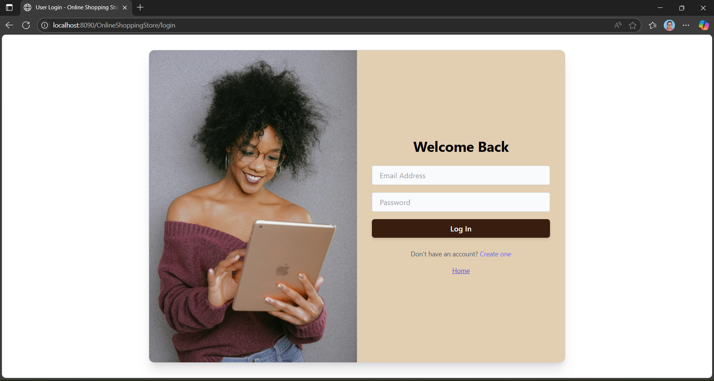
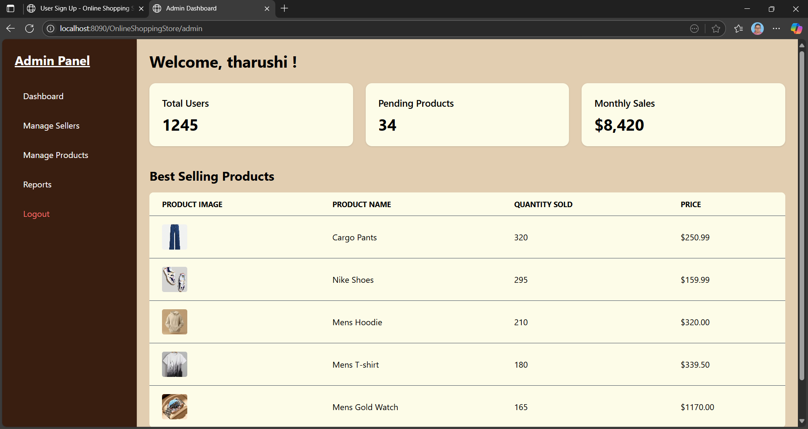
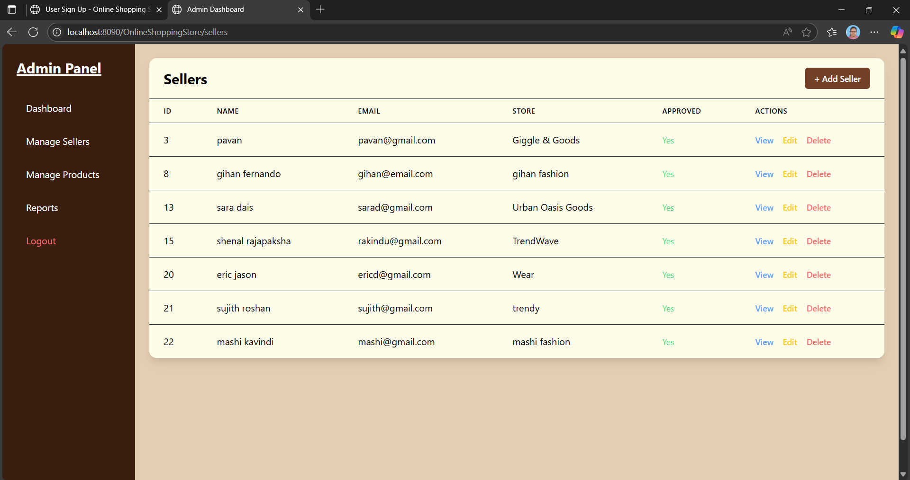

# JSP-servlet-SLIIT-Y2S1-OOP

OOP Online E-shopping store JSP servlet

This is the 2nd year 1st semester project for OOP module. The poject is to create web application using Java servlet MVC architecture with all the CRUD operations. This is a group project and a group has 4 members. In this project we are use *Java* as the programming laguage. And used MVC architecture also. Our topic is 'Online e-shopping store'. My part is create the User Management part of the website and build all the crud operations of 'Admin' role.

Below is the User Login page of the website.

## 🧾 User Login Page



Below is the admin dashboard. All the controlability for admin is in this page.

## 🧾 Admin Dashboard Page



In the below page, it shows all the added sellers seperately. And also it includes 'Update'and 'Delete' options. When admin click 'Update' button, it redirect to the specific seller's updatable form. The form includes previously added details of the seller. Admin can update all the details from that form. And when Admin clicks 'Delete' button, it redirect to the form with that already inserted details. In this form Admin can not change any details of the item. Because it all are read only. Then user click 'Delete item', the system popups the alert message whether the item should delete or not. If user click 'Yes' the seller will delete and redirect to the all sellers page.

This fulfills the all part of my CRUD operations. Add seller option in below page, the admin can add new seller including their details.

## 🧾 All sellers Page



## Used Technology Stack

🌐 Frontend: HTML, CSS, JavaScript

📦 Backend: JAVA

🗄️ Database: MySQL Workbench

## 🚀 How to Deploy & Run the Online Shopping Store (Java Web Project)

A complete step-by-step guide to run this project locally using **Eclipse**, **MySQL Workbench**, and **Apache Tomcat v9**.

---

### ✅ Requirements

Make sure you have the following installed:

- ☕ **Java JDK 8** or later  
- 🧠 **Eclipse IDE** (Enterprise Edition preferred)  
- 🌐 **Apache Tomcat v9**  
- 🐬 **MySQL Server & MySQL Workbench**  
- 📦 **Project Archive**: `OnlineShoppingStore.zip`  
- 🗃️ **Database Script**: `onlineshoppingstore new.sql`

---

### 📥 1. Import Project into Eclipse

1. Launch **Eclipse IDE**  
2. Go to: `File` → `Import` → `Existing Projects into Workspace`  
3. Choose **Select archive file**, then click `Browse...` and select `OnlineShoppingStore.zip`  
4. Click `Finish` to import the project

---

### 🛠️ 2. Set Up the Database in MySQL

1. Open **MySQL Workbench**  
2. Create a new **schema** named:  
3. Open the SQL file: `onlineshoppingstore new.sql`  
4. Execute the script to create all required **tables** and **sample data**

---

### 🔧 3. Configure Database Connection in the Project

1. In Eclipse, locate the file:  
2. Update the connection details:

```java
URL      = "jdbc:mysql://localhost:3306/onlineshoppingstore";
USER     = "root";
PASSWORD = "your_password";
